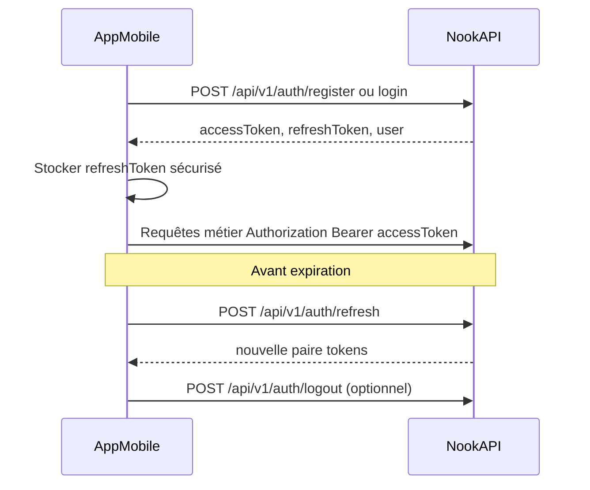
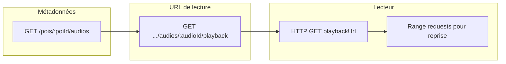

# NOOK API — référence client (mobile / IA)

Document **canonique dans le dépôt backend** ; l’application mobile vit dans **un autre repository**. Tout ce qui est nécessaire pour appeler l’API (chemins, auth, erreurs) est résumé ici ; le détail exhaustif des schémas reste **OpenAPI** (Swagger) sur votre instance.

## Table des matières

1. [Consommation hors de ce repo](#consommation-hors-de-ce-repo)
2. [Contrat transversal](#contrat-transversal)
3. [Authentification et tokens](#authentification-et-tokens)
4. [Endpoints REST v1 (mobile-first)](#endpoints-rest-v1-mobile-first)
5. [Flux (diagrammes)](#flux-diagrammes)
6. [Alignement fonctionnel (F-XXX)](#alignement-fonctionnel-f-xxx)
7. [Annexe — Admin et génération audio](#annexe--admin-et-génération-audio)
8. [Ressources liées](#ressources-liées)

---

## Consommation hors de ce repo

- **Base HTTP** : définir dans l’app mobile une variable d’environnement `API_BASE_URL` (origine HTTPS **sans** slash final), par ex. `https://api.example.com`.
- **Composition des URLs** : `{API_BASE_URL}/api/v1/...` pour la version métier ; `{API_BASE_URL}/api/health` pour le healthcheck (sans segment `/v1`).
- **Ce fichier** peut être **copié** dans le repo mobile, lu depuis le dépôt API (lien Git), ou attaché à une issue / outil IA.
- **Chemins `src/...` dans ce document** : ils désignent le **dépôt API NOOK** (implémentation NestJS), pas le projet React Native. Ils servent aux mainteneurs et aux agents qui ont les deux clones.
- **Spécification machine** : interface Swagger à `{API_BASE_URL}/api/docs` ; le JSON OpenAPI est généralement exposé en parallèle par `@nestjs/swagger` (souvent `{API_BASE_URL}/api/docs-json` — à confirmer sur l’instance en ouvrant les outils réseau de la page Swagger).

---

## Contrat transversal

| Sujet | Règle |
|--------|--------|
| Version API | Préfixe global `api` + version URI **`v1`** → chemins `/api/v1/...`. |
| Format | JSON UTF-8 ; `Content-Type: application/json` pour les corps. |
| Champs inconnus | Le serveur utilise une validation **stricte** (`whitelist` + `forbidNonWhitelisted`) : **ne pas envoyer** de propriétés non documentées dans les corps de requête. |
| Dates | ISO 8601 (souvent instant UTC côté réponses). |
| Coordonnées | **WGS84** (latitude / longitude en degrés décimaux). |
| Pagination | Paramètres query `limit` (1–100, défaut **20**) et `offset` (≥0, défaut **0**) là où indiqué. |
| Auth | En-tête `Authorization: Bearer <accessToken>` pour les routes protégées. |
| Corrélation | Le serveur renvoie `X-Request-Id` ; le client peut envoyer `X-Request-Id` (string ≤ 128) pour corréler les logs. |
| Erreurs | Corps JSON : `statusCode`, `message`, optionnellement `code`, `details`, `requestId` (voir exemples ci-dessous). |
| Limitation (throttle) | Certaines routes renvoient **429** si la limite est dépassée (auth, play-event, guide-chat, admin génération audio). |

### Exemple de corps d’erreur (validation)

```json
{
  "statusCode": 422,
  "message": "Erreur de validation",
  "details": [
    {
      "property": "email",
      "constraints": { "isEmail": "email invalide" }
    }
  ],
  "requestId": "550e8400-e29b-41d4-a716-446655440000"
}
```

### Exemple d’erreur métier simple

```json
{
  "statusCode": 401,
  "message": "Identifiants invalides.",
  "requestId": "550e8400-e29b-41d4-a716-446655440000"
}
```

---

## Authentification et tokens

- **Réponse** `register`, `login`, `refresh` : objet avec `accessToken`, `refreshToken`, `user` (voir DTO côté API `src/auth/dto/auth-response.dto.ts`).
- **Accès aux routes protégées** : `Authorization: Bearer <accessToken>`.
- **Rafraîchissement** : `POST /api/v1/auth/refresh` avec corps `{ "refreshToken": "..." }` avant expiration du access token (stratégie de timing à définir côté app, ex. marge avant `exp`).
- **Déconnexion** : `POST /api/v1/auth/logout` avec `{ "refreshToken": "..." }` pour révoquer le refresh côté serveur.

### Exemple minimal — réponse tokens (schéma)

```json
{
  "accessToken": "<jwt>",
  "refreshToken": "<opaque>",
  "user": {
    "id": "uuid",
    "email": "user@example.com",
    "displayName": null,
    "firstName": null,
    "lastName": null,
    "birthDate": null,
    "role": "USER"
  }
}
```

Implémentation : `src/auth/dto/auth-response.dto.ts` (dépôt API).

---

## Endpoints REST v1 (mobile-first)

Légende **Auth** : `none` | `Bearer` (JWT obligatoire) | `Bearer?` (JWT optionnel — anonyme si absent).

### Santé (non versionné)

| Méthode | Chemin | Auth | Description | Codes notables |
|--------|--------|------|-------------|----------------|
| GET | `/api/health` | none | Liveness simple | 200 — `{ "status": "ok" }` |

Implémentation : `src/health/health.controller.ts`.

---

### Auth (`/api/v1/auth`)

| Méthode | Chemin | Auth | Description | Codes notables |
|--------|--------|------|-------------|----------------|
| POST | `/api/v1/auth/register` | none | Inscription | 200 + tokens ; 409 e-mail déjà utilisé ; 422 validation ; 429 throttle |
| POST | `/api/v1/auth/login` | none | Connexion | 200 + tokens ; 401 identifiants invalides ; 422 ; 429 |
| POST | `/api/v1/auth/refresh` | none | Nouvelle paire de tokens | 200 ; 401 refresh invalide/expiré ; 429 |
| POST | `/api/v1/auth/logout` | none | Révocation du refresh | 200 `{ "ok": true }` ; 422 ; 429 |

**Corps utiles (exemples)**

- Register : `{ "email": "…", "password": "… (≥8)", "displayName?": "…", "firstName?": "…", "lastName?": "…", "birthDate?": "ISO" }` — DTO : `src/auth/dto/register.dto.ts`
- Login : `{ "email": "…", "password": "…" }` — `src/auth/dto/login.dto.ts`
- Refresh / Logout : `{ "refreshToken": "…" }` — `src/auth/dto/refresh.dto.ts`, `src/auth/dto/logout.dto.ts`

Implémentation : `src/auth/auth.controller.ts`.

---

### Profil (`/api/v1/me`)

| Méthode | Chemin | Auth | Description | Codes notables |
|--------|--------|------|-------------|----------------|
| GET | `/api/v1/me` | Bearer | Profil courant (F-003) | 200 ; 401 |
| PATCH | `/api/v1/me` | Bearer | Mise à jour partielle profil | 200 ; 401 ; 422 |
| PATCH | `/api/v1/me/preferences` | Bearer | Fusion JSON des préférences | 200 ; 401 ; 422 |

DTO : `src/users/dto/me-profile-response.dto.ts`, `src/users/dto/patch-me.dto.ts`, `src/users/dto/patch-preferences.dto.ts`  
Implémentation : `src/users/me.controller.ts`.

---

### Catégories

| Méthode | Chemin | Auth | Description | Codes notables |
|--------|--------|------|-------------|----------------|
| GET | `/api/v1/categories` | none | Liste des catégories POI (taxonomie filtres) (F-008) | 200 |

DTO réponse : `src/categories/dto/categories-list.response.dto.ts`, `src/categories/dto/category-response.dto.ts`  
Implémentation : `src/categories/categories.controller.ts`.

---

### POI — catalogue, détail, enfants, popularité

| Méthode | Chemin | Auth | Description | Codes notables |
|--------|--------|------|-------------|----------------|
| GET | `/api/v1/pois` | none | Liste / carte / recherche (F-004 / F-005) | 200 ; 400 bbox invalide ; 422 si ni `q` ni filtre géo complet |
| GET | `/api/v1/pois/:id` | none | Détail POI publié (F-006) | 200 ; 404 |
| GET | `/api/v1/pois/:id/children` | none | Sous-POI paginés (F-006) | 200 ; 404 parent absent/non publié ; 422 |
| POST | `/api/v1/pois/:id/play-event` | Bearer? | Signal écoute / popularité (F-013) — **204 sans corps** | 204 ; 401 si Bearer invalide ; 404 ; 422 ; 429 |

**Règle obligatoire — `GET /api/v1/pois`** : fournir au moins l’un des groupes suivants (combinables avec filtres) :

- **`q`** : recherche texte (fuzzy trigram), **ou**
- **`bbox`** : `minLng,minLat,maxLng,maxLat` (4 nombres séparés par des virgules), **ou**
- **`lat` + `lng` + `radiusMeters`** : les trois ensemble (rayon max **100_000** m).

Paramètres fréquents : `category` (slug), `minRating`, `maxAudioDurationMinutes`, `sort` ∈ `relevance` | `distance` | `rating` | `title` (`distance` nécessite lat/lng/radius), `rootsOnly`, `limit`, `offset`.

Query détail : `includeAudios` (bool, défaut true) — `src/pois/dto/poi-detail.query.dto.ts`  
Query enfants : `sort` ∈ `title` | `updatedAt`, `limit`, `offset` — `src/pois/dto/list-poi-children.query.dto.ts`  
Liste POI : `src/pois/dto/list-pois.query.dto.ts`  
Play event corps : `src/pois/dto/create-play-event.dto.ts` (au moins `listenPercent` ou `durationSeconds` ; `clientEventId` pour idempotence).

Implémentation : `src/pois/pois.controller.ts`.

---

### Audios (lecture publique)

| Méthode | Chemin | Auth | Description | Codes notables |
|--------|--------|------|-------------|----------------|
| GET | `/api/v1/pois/:poiId/audios` | none | Métadonnées des pistes publiées (F-007) | 200 ; 404 |
| GET | `/api/v1/pois/:poiId/audios/:audioId/playback` | none | URL pré-signée courte durée (F-007) | 200 ; 404 ; 503 config média absente |

**Client audio** : le lecteur doit utiliser l’URL retournée et supporter **HTTP Range** pour reprise / seek (UC-007-2).

DTO : `src/audios/dto/audio-track-public.dto.ts`, `src/audios/dto/audio-playback.response.dto.ts`  
Implémentation : `src/audios/audios.controller.ts`.

---

### Discovery (feed)

| Méthode | Chemin | Auth | Description | Codes notables |
|--------|--------|------|-------------|----------------|
| GET | `/api/v1/discovery/latest` | none | Derniers POI publiés (F-009) | 200 ; 422 |
| GET | `/api/v1/discovery/popular` | none | Les plus écoutés (F-009) | 200 ; 422 |
| GET | `/api/v1/discovery/top-rated` | none | Les mieux notés (F-009) | 200 ; 422 |

Query : `limit`, `offset` — `src/discovery/dto/list-discovery.query.dto.ts`  
Réponses : `src/discovery/dto/discovery-item.response.dto.ts`  
Implémentation : `src/discovery/discovery.controller.ts`.

---

### Itinéraires (parcours utilisateur)

**Périmètre app actuel :** consultation (`GET`) et suppression (`DELETE`) uniquement. Création et édition (`POST` / `PATCH`) hors périmètre.

| Méthode | Chemin | Auth | Description | Codes notables |
|--------|--------|------|-------------|----------------|
| GET | `/api/v1/itineraries` | Bearer | Liste mes parcours (F-010) | 200 ; 401 ; 422 |
| GET | `/api/v1/itineraries/:id` | Bearer | Détail + étapes | 200 ; 401 ; 404 |
| DELETE | `/api/v1/itineraries/:id` | Bearer | Suppression | 204 ; 401 ; 404 |

DTO : `src/itineraries/dto/list-itineraries.query.dto.ts`, réponses sous `src/itineraries/dto/*.response.dto.ts`  
Implémentation : `src/itineraries/itineraries.controller.ts`.

**Évolution (contrat API existant, non exposé in-app)**

| Méthode | Chemin | Auth | Description | Codes notables |
|--------|--------|------|-------------|----------------|
| POST | `/api/v1/itineraries` | Bearer | Créer (≥2 POI publiés, ordre conservé) | 201 ; 401 ; 422 |
| PATCH | `/api/v1/itineraries/:id` | Bearer | Mise à jour partielle | 200 ; 401 ; 404 ; 422 |

DTO : `src/itineraries/dto/create-itinerary.dto.ts`, `patch-itinerary.dto.ts`

---

### Favoris

| Méthode | Chemin | Auth | Description | Codes notables |
|--------|--------|------|-------------|----------------|
| GET | `/api/v1/me/favorites` | Bearer | Liste favoris (F-011) | 200 ; 401 ; 422 |
| POST | `/api/v1/me/favorites` | Bearer | Ajouter `{ "poiId" }` | **201** création, **200** si déjà favori ; 401 ; 422 |
| POST | `/api/v1/me/favorites/:poiId` | Bearer | Idem par chemin | 201 / 200 |
| DELETE | `/api/v1/me/favorites/:poiId` | Bearer | Retirer | **204** (idempotent si absent) ; 401 |

DTO : `src/favorites/dto/add-favorite.dto.ts`, `list-favorites.query.dto.ts`, réponses `src/favorites/dto/*.response.dto.ts`  
Implémentation : `src/favorites/favorites.controller.ts`.

---

### Historique d’écoute

| Méthode | Chemin | Auth | Description | Codes notables |
|--------|--------|------|-------------|----------------|
| GET | `/api/v1/me/listen-history` | Bearer | Liste (F-012) | 200 ; 401 ; 422 |
| POST | `/api/v1/me/listen-history` | Bearer | Enregistrer une écoute | 201 ; 401 ; 422 |

Corps POST : `audioId` obligatoire ; `poiId` optionnel (cohérent avec la piste) ; `progressSeconds` optionnel — `src/listen-history/dto/create-listen-history.dto.ts`  
Implémentation : `src/listen-history/listen-history.controller.ts`.

---

### Chat guide IA par POI (F-016)

| Méthode | Chemin | Auth | Description | Codes notables |
|--------|--------|------|-------------|----------------|
| GET | `/api/v1/me/pois/:poiId/guide-chat/messages` | Bearer | Historique + solde crédits | 200 ; 401 ; 422 |
| POST | `/api/v1/me/pois/:poiId/guide-chat/messages` | Bearer | Envoyer un message | 201 ; 401 ; 422 (ex. `GUIDE_CHAT_NO_SOURCES`) ; **402** crédits insuffisants (`code`: `GUIDE_CHAT_INSUFFICIENT_CREDITS`) ; 429 |

Corps POST : `{ "content": "…" }` (max **4000** caractères) — `src/guide-chat/dto/send-guide-chat-message.dto.ts`  
Query liste : `src/guide-chat/dto/list-guide-chat-messages.query.dto.ts`  
Implémentation : `src/guide-chat/guide-chat.controller.ts`.

---

### Génération guide audio IA — utilisateur (F-015 user, spec A3.3)

> **Statut :** contrat cible documenté pour l’app mobile ; endpoints `/me/…` à implémenter côté API (aujourd’hui seule la voie **admin** existe en annexe).

| Méthode | Chemin | Auth | Description | Codes notables |
|--------|--------|------|-------------|----------------|
| GET | `/api/v1/me/credits` | Bearer | Solde crédits + quota générations abonnement (mois courant) | 200 ; 401 |
| POST | `/api/v1/me/pois/:poiId/audio-guides/generate` | Bearer | Lance un job ; guide **privé auteur** | **202** + `jobId` ; 401 ; 422 ; **402** (`AUDIO_GUIDE_INSUFFICIENT_CREDITS`) ; 429 |
| GET | `/api/v1/me/audio-guides/jobs/:jobId` | Bearer | Statut job (auteur uniquement) | 200 ; 404 ; 401 |

**Corps POST proposé**

```json
{
  "wikipediaUrl": "https://fr.wikipedia.org/wiki/Tour_Eiffel",
  "durationTier": "normal",
  "language": "fr"
}
```

| `durationTier` | Crédits débités |
|----------------|-----------------|
| `short` | 1 |
| `normal` | 2 |
| `detailed` | 3 |

Consommation proposée : **quota abonnement** en priorité, puis **crédits achetés** (packs in-app, spec **A8.4**). Voir [`ecran-A3.3-creation-guide-audio-ia.md`](./ecran-A3.3-creation-guide-audio-ia.md).

Voie admin existante (production éditoriale) : voir [Annexe — Admin et génération audio](#annexe--admin-et-génération-audio).

---

## Flux (diagrammes)

### Auth — inscription / session



### Lecture audio



---

## Alignement fonctionnel (F-XXX)

Les cas d’usage produit et les ids de fonctionnalités (**F-002**, **F-003**, **F-004**, etc.) sont décrits dans :

- [api-fonctionnalites-et-cas-d-usage.md](./api-fonctionnalites-et-cas-d-usage.md)

Utiliser ce fichier pour le **parcours utilisateur** et la priorisation d’implémentation dans l’app ; la présente référence décrit le **contrat HTTP** aligné sur ces fonctionnalités.

---

## Annexe — Admin et génération audio

Toutes les routes ci-dessous exigent **`Authorization: Bearer`** avec un compte **`role: ADMIN`**. Elles servent au back-office / outillage, pas au parcours grand public mobile.

### POI admin (F-014)

| Méthode | Chemin | Description | Codes notables |
|--------|--------|-------------|----------------|
| GET | `/api/v1/admin/pois/:id` | Détail POI (images avec URLs pré-signées si configuré) | 200 ; 404 |
| POST | `/api/v1/admin/pois` | Création (statut par défaut brouillon) | 201 ; 422 |
| PATCH | `/api/v1/admin/pois/:id` | Mise à jour | 200 ; 404 ; 422 |
| DELETE | `/api/v1/admin/pois/:id` | Suppression | 204 ; 404 ; 409 si références |

DTO : `src/pois/dto/create-admin-poi.dto.ts`, `update-admin-poi.dto.ts`, `admin-poi-response.dto.ts`  
Implémentation : `src/pois/admin-pois.controller.ts`.

### Images POI admin (F-014)

| Méthode | Chemin | Description |
|--------|--------|-------------|
| POST | `/api/v1/admin/pois/:poiId/images/presign-upload` | URL PUT pré-signée pour upload |
| POST | `/api/v1/admin/pois/:poiId/images` | Enregistrer l’image après upload |
| PATCH | `/api/v1/admin/pois/:poiId/images/:imageId` | Métadonnées |
| DELETE | `/api/v1/admin/pois/:poiId/images/:imageId` | Suppression |

Implémentation : `src/pois/admin-poi-images.controller.ts`.

### Catégories admin (F-008)

| Méthode | Chemin | Description |
|--------|--------|-------------|
| POST | `/api/v1/admin/categories` | Créer |
| PATCH | `/api/v1/admin/categories/:id` | Mettre à jour |
| DELETE | `/api/v1/admin/categories/:id` | Supprimer (si non utilisée) |

Implémentation : `src/categories/admin-categories.controller.ts`.

### Génération audio IA (F-015)

| Méthode | Chemin | Description | Codes notables |
|--------|--------|-------------|----------------|
| POST | `/api/v1/admin/pois/:poiId/audio-guides/generate` | Lance un job (corps : `wikipediaUrl`, options) | **202** + `jobId` ; 422 ; 429 |
| GET | `/api/v1/admin/audio-guides/jobs/:jobId` | Statut du job | 200 ; 404 |
| POST | `/api/v1/admin/audio-guides/jobs/:jobId/retry` | Relance | 200 ; 404 ; 422 ; 429 |

DTO génération : `src/audio-generation/dto/generate-audio-guide.dto.ts`  
Réponses job : `src/audio-generation/dto/audio-guide-job-response.dto.ts`  
Implémentation : `src/audio-generation/audio-generation.controller.ts`, `audio-generation-jobs.controller.ts`.

**Exemple corps génération**

```json
{
  "wikipediaUrl": "https://fr.wikipedia.org/wiki/Tour_Eiffel",
  "language": "fr",
  "targetDurationMinutes": 4
}
```

---

## Ressources liées

| Ressource | Emplacement |
|-----------|-------------|
| Swagger UI (contrat interactif) | `{API_BASE_URL}/api/docs` |
| Cas d’usage et F-XXX | [docs/api-fonctionnalites-et-cas-d-usage.md](./api-fonctionnalites-et-cas-d-usage.md) |
| Vision produit / stack | [docs/brief.md](./brief.md) |
| Filtre d’erreurs HTTP | Dépôt API : `src/common/filters/http-exception.filter.ts` |
| Bootstrap (préfixe, versioning, validation) | Dépôt API : `src/main.ts` |

---

*Document généré pour l’intégration client ; en cas d’écart avec le code déployé, prévaloir sur l’instance réelle et le schéma OpenAPI exporté depuis Swagger.*
