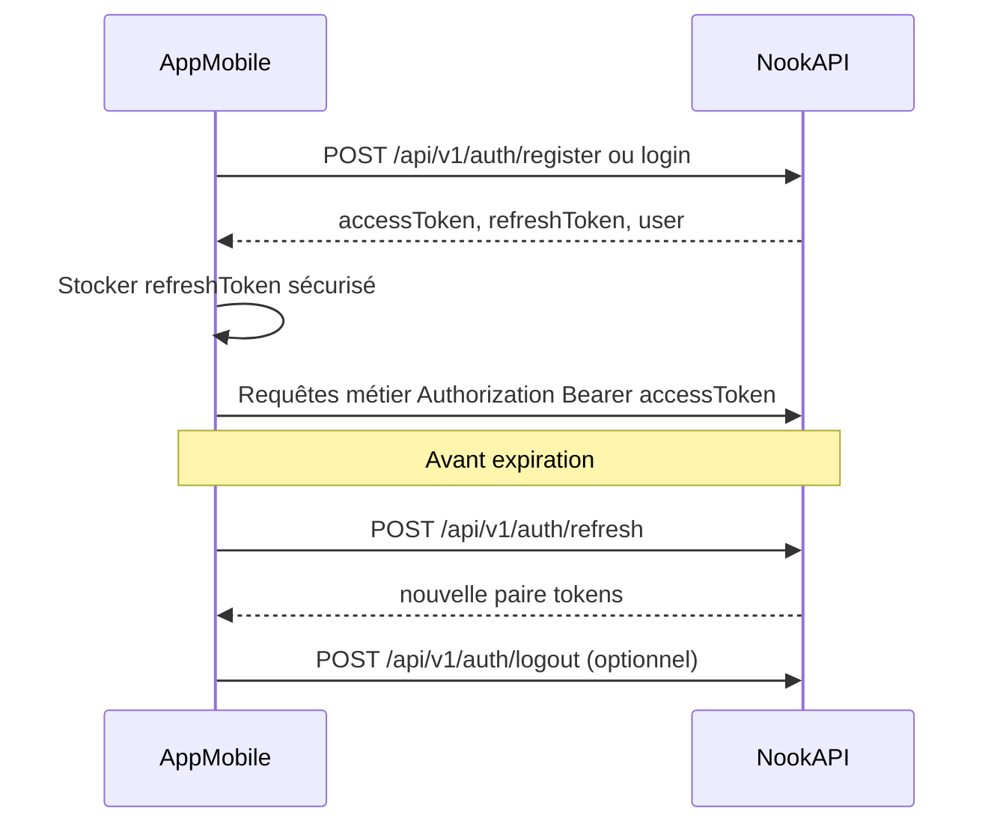
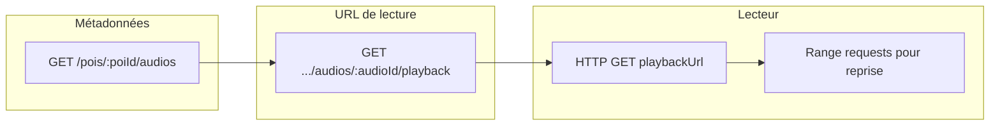

# NOOK API — référence client (mobile / IA)

Document **canonique dans le dépôt backend** ; l’application mobile vit dans **un autre repository**. Tout ce qui est nécessaire pour appeler l’API (chemins, auth, erreurs) est résumé ici ; le détail exhaustif des schémas reste **OpenAPI** (Swagger) sur votre instance.

## Table des matières

1. [Consommation hors de ce repo](#consommation-hors-de-ce-repo)
2. [Contrat transversal](#contrat-transversal)
3. [Authentification et tokens](#authentification-et-tokens)
4. [Endpoints REST v1 (mobile-first)](#endpoints-rest-v1-mobile-first)
5. [Flux (diagrammes)](#flux-diagrammes)
6. [Alignement fonctionnel (F-XXX)](#alignement-fonctionnel-f-xxx)
7. [Annexe — Admin et génération audio](#annexe--admin-et-génération-audio)
8. [Ressources liées](#ressources-liées)

---

## Consommation hors de ce repo

- **Base HTTP** : définir dans l’app mobile une variable d’environnement `API_BASE_URL` (origine HTTPS **sans** slash final), par ex. `https://api.example.com`.
- **Composition des URLs** : `{API_BASE_URL}/api/v1/...` pour la version métier ; `{API_BASE_URL}/api/health` pour le healthcheck (sans segment `/v1`).
- **Ce fichier** peut être **copié** dans le repo mobile, lu depuis le dépôt API (lien Git), ou attaché à une issue / outil IA.
- **Chemins `src/...` dans ce document** : ils désignent le **dépôt API NOOK** (implémentation NestJS), pas le projet React Native. Ils servent aux mainteneurs et aux agents qui ont les deux clones.
- **Spécification machine** : interface Swagger à `{API_BASE_URL}/api/docs` ; le JSON OpenAPI est généralement exposé en parallèle par `@nestjs/swagger` (souvent `{API_BASE_URL}/api/docs-json` — à confirmer sur l’instance en ouvrant les outils réseau de la page Swagger).

---

## Contrat transversal

| Sujet | Règle |
|--------|--------|
| Version API | Préfixe global `api` + version URI **`v1`** → chemins `/api/v1/...`. |
| Format | JSON UTF-8 ; `Content-Type: application/json` pour les corps. |
| Champs inconnus | Le serveur utilise une validation **stricte** (`whitelist` + `forbidNonWhitelisted`) : **ne pas envoyer** de propriétés non documentées dans les corps de requête. |
| Dates | ISO 8601 (souvent instant UTC côté réponses). |
| Coordonnées | **WGS84** (latitude / longitude en degrés décimaux). |
| Pagination | Paramètres query `limit` (1–100, défaut **20**) et `offset` (≥0, défaut **0**) là où indiqué. |
| Auth | En-tête `Authorization: Bearer <accessToken>` pour les routes protégées. |
| Corrélation | Le serveur renvoie `X-Request-Id` ; le client peut envoyer `X-Request-Id` (string ≤ 128) pour corréler les logs. |
| Erreurs | Corps JSON : `statusCode`, `message`, optionnellement `code`, `details`, `requestId` (voir exemples ci-dessous). |
| Limitation (throttle) | Certaines routes renvoient **429** si la limite est dépassée (auth, play-event, guide-chat, admin génération audio). |

### Exemple de corps d’erreur (validation)

```json
{
  "statusCode": 422,
  "message": "Erreur de validation",
  "details": [
    {
      "property": "email",
      "constraints": { "isEmail": "email invalide" }
    }
  ],
  "requestId": "550e8400-e29b-41d4-a716-446655440000"
}
```

### Exemple d’erreur métier simple

```json
{
  "statusCode": 401,
  "message": "Identifiants invalides.",
  "requestId": "550e8400-e29b-41d4-a716-446655440000"
}
```

---

## Authentification et tokens

- **Réponse** `register`, `login`, `refresh` : objet avec `accessToken`, `refreshToken`, `user` (voir DTO côté API `src/auth/dto/auth-response.dto.ts`).
- **Accès aux routes protégées** : `Authorization: Bearer <accessToken>`.
- **Rafraîchissement** : `POST /api/v1/auth/refresh` avec corps `{ "refreshToken": "..." }` avant expiration du access token (stratégie de timing à définir côté app, ex. marge avant `exp`).
- **Déconnexion** : `POST /api/v1/auth/logout` avec `{ "refreshToken": "..." }` pour révoquer le refresh côté serveur.

### Exemple minimal — réponse tokens (schéma)

```json
{
  "accessToken": "<jwt>",
  "refreshToken": "<opaque>",
  "user": {
    "id": "uuid",
    "email": "user@example.com",
    "displayName": null,
    "firstName": null,
    "lastName": null,
    "birthDate": null,
    "role": "USER"
  }
}
```

Implémentation : `src/auth/dto/auth-response.dto.ts` (dépôt API).

---

## Endpoints REST v1 (mobile-first)

Légende **Auth** : `none` | `Bearer` (JWT obligatoire) | `Bearer?` (JWT optionnel — anonyme si absent).

### Santé (non versionné)

| Méthode | Chemin | Auth | Description | Codes notables |
|--------|--------|------|-------------|----------------|
| GET | `/api/health` | none | Liveness simple | 200 — `{ "status": "ok" }` |

Implémentation : `src/health/health.controller.ts`.

---

### Auth (`/api/v1/auth`)

| Méthode | Chemin | Auth | Description | Codes notables |
|--------|--------|------|-------------|----------------|
| POST | `/api/v1/auth/register` | none | Inscription | 200 + tokens ; 409 e-mail déjà utilisé ; 422 validation ; 429 throttle |
| POST | `/api/v1/auth/login` | none | Connexion | 200 + tokens ; 401 identifiants invalides ; 422 ; 429 |
| POST | `/api/v1/auth/refresh` | none | Nouvelle paire de tokens | 200 ; 401 refresh invalide/expiré ; 429 |
| POST | `/api/v1/auth/logout` | none | Révocation du refresh | 200 `{ "ok": true }` ; 422 ; 429 |
| POST | `/api/v1/auth/forgot-password` | none | Demande reset MDP (réponse neutre) | 200 `{ "ok": true }` ; 422 ; 429 |
| POST | `/api/v1/auth/reset-password` | none | Appliquer nouveau MDP via jeton | 200 `{ "ok": true }` ; 401 jeton invalide/expiré ; 422 ; 429 |

**Corps utiles (exemples)**

- Register : `{ "email": "…", "password": "… (≥8)", "displayName?": "…", "firstName?": "…", "lastName?": "…", "birthDate?": "ISO" }` — DTO : `src/auth/dto/register.dto.ts`
- Login : `{ "email": "…", "password": "…" }` — `src/auth/dto/login.dto.ts`
- Refresh / Logout : `{ "refreshToken": "…" }` — `src/auth/dto/refresh.dto.ts`, `src/auth/dto/logout.dto.ts`
- Forgot password : `{ "email": "…" }` — `src/auth/dto/forgot-password.dto.ts` — en non-production le jeton plain est **logué** côté API (pas d’e-mail SMTP en V1).
- Reset password : `{ "token": "…", "password": "… (≥8)" }` — `src/auth/dto/reset-password.dto.ts`

Implémentation : `src/auth/auth.controller.ts`.

---

### Profil (`/api/v1/me`)

| Méthode | Chemin | Auth | Description | Codes notables |
|--------|--------|------|-------------|----------------|
| GET | `/api/v1/me` | Bearer | Profil courant (F-003) | 200 ; 401 |
| PATCH | `/api/v1/me` | Bearer | Mise à jour partielle profil | 200 ; 401 ; 422 |
| PATCH | `/api/v1/me/preferences` | Bearer | Fusion JSON des préférences | 200 ; 401 ; 422 |

DTO : `src/users/dto/me-profile-response.dto.ts`, `src/users/dto/patch-me.dto.ts`, `src/users/dto/patch-preferences.dto.ts`  
Implémentation : `src/users/me.controller.ts`.

---

### Catégories

| Méthode | Chemin | Auth | Description | Codes notables |
|--------|--------|------|-------------|----------------|
| GET | `/api/v1/categories` | none | Liste des catégories POI (taxonomie filtres) (F-008) | 200 |

DTO réponse : `src/categories/dto/categories-list.response.dto.ts`, `src/categories/dto/category-response.dto.ts`  
Implémentation : `src/categories/categories.controller.ts`.

---

### POI — catalogue, détail, enfants, popularité

| Méthode | Chemin | Auth | Description | Codes notables |
|--------|--------|------|-------------|----------------|
| GET | `/api/v1/pois` | none | Liste / carte / recherche (F-004 / F-005) | 200 ; 400 bbox invalide ; 422 si ni `q` ni filtre géo complet |
| GET | `/api/v1/pois/:id` | none | Détail POI publié (F-006) : `address`, `wikipediaUrl`, `coverImage` (URL pré-signée) | 200 ; 404 |
| GET | `/api/v1/pois/:id/children` | none | Sous-POI paginés (F-006) | 200 ; 404 parent absent/non publié ; 422 |
| POST | `/api/v1/pois/:id/play-event` | Bearer? | Signal écoute / popularité (F-013) — **204 sans corps** | 204 ; 401 si Bearer invalide ; 404 ; 422 ; 429 |

**Règle obligatoire — `GET /api/v1/pois`** : fournir au moins l’un des groupes suivants (combinables avec filtres) :

- **`q`** : recherche texte (fuzzy trigram), **ou**
- **`bbox`** : `minLng,minLat,maxLng,maxLat` (4 nombres séparés par des virgules), **ou**
- **`lat` + `lng` + `radiusMeters`** : les trois ensemble (rayon max **100_000** m).

Paramètres fréquents : `category` (slug), `minRating`, `maxAudioDurationMinutes`, `sort` ∈ `relevance` | `distance` | `rating` | `title` (`distance` nécessite lat/lng/radius), `rootsOnly`, `limit`, `offset`.

Query détail : `includeAudios` (bool, défaut true) — `src/pois/dto/poi-detail.query.dto.ts`  
Query enfants : `sort` ∈ `title` | `updatedAt`, `limit`, `offset` — `src/pois/dto/list-poi-children.query.dto.ts`  
Liste POI : `src/pois/dto/list-pois.query.dto.ts`  
Play event corps : `src/pois/dto/create-play-event.dto.ts` (au moins `listenPercent` ou `durationSeconds` ; `clientEventId` pour idempotence).

Implémentation : `src/pois/pois.controller.ts`.

---

### Audios (lecture publique)

| Méthode | Chemin | Auth | Description | Codes notables |
|--------|--------|------|-------------|----------------|
| GET | `/api/v1/pois/:poiId/audios` | none | Métadonnées des pistes publiées (F-007) | 200 ; 404 |
| GET | `/api/v1/pois/:poiId/audios/:audioId/playback` | none (Bearer optionnel) | URL pré-signée courte durée (F-007) ; auteur JWT pour piste privée | 200 ; 404 ; 503 config média absente |
| GET | `/api/v1/pois/:poiId/audios/:audioId/transcript` | none (Bearer optionnel) | Segments horodatés Contenu (`{ segments: [{ id, startMs, endMs, text }] }`) ; auteur JWT pour piste privée | 200 ; 404 |

**Client audio** : le lecteur doit utiliser l’URL retournée et supporter **HTTP Range** pour reprise / seek (UC-007-2). L’onglet Contenu consomme le transcript pour le surlignage phrase.

DTO : `src/audios/dto/audio-track-public.dto.ts`, `src/audios/dto/audio-playback.response.dto.ts`, `src/audios/dto/audio-transcript.response.dto.ts`  
Implémentation : `src/audios/audios.controller.ts`.

---

### Discovery (feed)

| Méthode | Chemin | Auth | Description | Codes notables |
|--------|--------|------|-------------|----------------|
| GET | `/api/v1/discovery/latest` | none | Derniers POI publiés (F-009) | 200 ; 422 |
| GET | `/api/v1/discovery/popular` | none | Les plus écoutés (F-009) | 200 ; 422 |
| GET | `/api/v1/discovery/top-rated` | none | Les mieux notés (F-009) | 200 ; 422 |

Query : `limit`, `offset` — `src/discovery/dto/list-discovery.query.dto.ts`  
Réponses : `src/discovery/dto/discovery-item.response.dto.ts`  
Implémentation : `src/discovery/discovery.controller.ts`.

---

### Villes et hubs territoriaux (F-018)

> Spec détaillée (dépôt API) : [`nook_api_v2/docs/spec-f018-hubs-ville.md`](../../../nook_api_v2/docs/spec-f018-hubs-ville.md)  
> **F-018-a** (liste) : implémenté · **F-018-b** (hub ville) : implémenté · **hubs quartier A4.5** : implémenté (T19, option B)

| Méthode | Chemin | Auth | Description | Codes notables |
|--------|--------|------|-------------|----------------|
| GET | `/api/v1/cities` | none | Liste / recherche villes publiées (F-018-a) | 200 ; 422 |
| GET | `/api/v1/cities/:slugOrId/hub` | none | Vitrine hub ville A4.3 (F-018-b) | 200 ; 404 ; 422 |
| GET | `/api/v1/cities/:citySlug/districts/:districtSlug/hub` | none | Vitrine hub quartier A4.5 (T19) | 200 ; 404 ; 422 |

**`GET /cities`** — query : `q`, `promoted`, `popular`, `limit`, `offset`  
Réponse : `PaginatedResponse<CityListItemDto>` (`nook_api_v2/src/cities/dto/list-cities.response.dto.ts`) — cover pré-signée, `stats` (`districtHubCount` = hubs quartier publiés), `isPromoted`.  
Seules les villes `status = PUBLISHED`. Tri : `sortOrder DESC, name ASC, id ASC` (éditorial / `popular` / `promoted`) ; `name ASC, id ASC` si `q`.  
`popular=true` : alias section A4.1 — même jeu et tri que la liste par défaut (pas de filtre additionnel).

**`GET /cities/:slugOrId/hub`** — réponse : `CityHubResponseDto`.

**`GET /cities/:citySlug/districts/:districtSlug/hub`** — réponse : `DistrictHubResponseDto` (`citySlug`, `cityName`, `anchorPoiId`, must-see / recommended). Seed Paris : `le-marais`, `montmartre`.

---

### Itinéraires éditoriaux (T21a / F-018-c)

> Parcours curated hub ville / quartier — **distincts** des parcours utilisateur F-010 (`/itineraries`).

| Méthode | Chemin | Auth | Description | Codes notables |
|--------|--------|------|-------------|----------------|
| GET | `/api/v1/editorial-itineraries` | none | Liste paginée (ville requise) | 200 ; 404 ; 422 |
| GET | `/api/v1/editorial-itineraries/:idOrSlug` | none | Détail + étapes géolocalisées | 200 ; 404 ; 422 |

**`GET /editorial-itineraries`** — query : `citySlug` (requis), `categorySlug?`, `districtSlug?`, `limit` (défaut 20, max 100), `offset`.  
- Sans `districtSlug` : uniquement itinéraires **sans** district (scope ville).  
- Avec `districtSlug` : filtrés sur ce quartier publié.  
Seuls les enregistrements `status = PUBLISHED`. Tri déterministe : `editorialOrder ASC, id ASC`.  
Réponse : `PaginatedResponse<EditorialItineraryListItemDto>` — `id`, `slug`, `citySlug`, `districtSlug|null`, `categorySlug`, `title`, `description`, `coverImageUrl`, `durationMinutes`, `distanceMeters`, `difficulty`, `stepCount`, `stepPoiIds`, `isPremium`, `priceLabel`, `editorialOrder`.

**`GET /editorial-itineraries/:idOrSlug`** — UUID ou slug ; `PUBLISHED` uniquement.  
Réponse détail + `steps[]` : `{ order, poiId, title, lat, lng }`.

Hubs ville / quartier exposent aussi `itineraryCategories: [{ slug, itineraryCount }]` et `featuredPremiumItinerary` (résumé).  
Seed : slugs `itin-paris-*`, `itin-marais-*`.

---

### Itinéraires (parcours utilisateur)

**Périmètre app actuel :** consultation (`GET`) et suppression (`DELETE`) uniquement. Création et édition (`POST` / `PATCH`) hors périmètre.

| Méthode | Chemin | Auth | Description | Codes notables |
|--------|--------|------|-------------|----------------|
| GET | `/api/v1/itineraries` | Bearer | Liste mes parcours (F-010) | 200 ; 401 ; 422 |
| GET | `/api/v1/itineraries/:id` | Bearer | Détail + étapes | 200 ; 401 ; 404 |
| DELETE | `/api/v1/itineraries/:id` | Bearer | Suppression | 204 ; 401 ; 404 |

DTO : `src/itineraries/dto/list-itineraries.query.dto.ts`, réponses sous `src/itineraries/dto/*.response.dto.ts`  
Implémentation : `src/itineraries/itineraries.controller.ts`.

**Évolution (contrat API existant, non exposé in-app)**

| Méthode | Chemin | Auth | Description | Codes notables |
|--------|--------|------|-------------|----------------|
| POST | `/api/v1/itineraries` | Bearer | Créer (≥2 POI publiés, ordre conservé) | 201 ; 401 ; 422 |
| PATCH | `/api/v1/itineraries/:id` | Bearer | Mise à jour partielle | 200 ; 401 ; 404 ; 422 |

DTO : `src/itineraries/dto/create-itinerary.dto.ts`, `patch-itinerary.dto.ts`

---

### Favoris

| Méthode | Chemin | Auth | Description | Codes notables |
|--------|--------|------|-------------|----------------|
| GET | `/api/v1/me/favorites` | Bearer | Liste favoris discriminés (F-011 / T21b) | 200 ; 401 ; 422 |
| POST | `/api/v1/me/favorites` | Bearer | Ajouter `{ "targetType", "targetId" }` | **201** création, **200** si déjà favori ; 401 ; 422 |
| DELETE | `/api/v1/me/favorites/:targetType/:targetId` | Bearer | Retirer (`poi` \| `editorial_itinerary` + UUID) | **204** (idempotent si absent) ; 401 ; 422 |

Items GET/POST : envelope `{ targetType, id, createdAt, target }` où `id` = `targetId`.

- **POI** : `{ "targetType": "poi", "id": "<poiId>", "createdAt", "target": { "id", "title", "status" } }`
- **Éditorial** : `{ "targetType": "editorial_itinerary", "id": "<editorialId>", "createdAt", "target": { "id", "slug", "title", "coverImageUrl" } }`

POST body : `{ "targetType": "poi" \| "editorial_itinerary", "targetId": "<uuid>" }` ; 422 si validation / cible non publiée.

DTO : `src/favorites/dto/add-favorite.dto.ts`, `list-favorites.query.dto.ts`, réponses `src/favorites/dto/*.response.dto.ts`  
Implémentation : `src/favorites/favorites.controller.ts`.

---

### Historique d’écoute

| Méthode | Chemin | Auth | Description | Codes notables |
|--------|--------|------|-------------|----------------|
| GET | `/api/v1/me/listen-history` | Bearer | Liste (F-012) | 200 ; 401 ; 422 |
| POST | `/api/v1/me/listen-history` | Bearer | Enregistrer une écoute | 201 ; 401 ; 422 |

Corps POST : `audioId` obligatoire ; `poiId` optionnel (cohérent avec la piste) ; `progressSeconds` optionnel — `src/listen-history/dto/create-listen-history.dto.ts`  
Implémentation : `src/listen-history/listen-history.controller.ts`.

---

### Chat guide IA par POI (F-016)

| Méthode | Chemin | Auth | Description | Codes notables |
|--------|--------|------|-------------|----------------|
| GET | `/api/v1/me/pois/:poiId/guide-chat/messages` | Bearer | Historique + solde crédits | 200 ; 401 ; 422 |
| POST | `/api/v1/me/pois/:poiId/guide-chat/messages` | Bearer | Envoyer un message | 201 ; 401 ; 422 (ex. `GUIDE_CHAT_NO_SOURCES`) ; **402** crédits insuffisants (`code`: `GUIDE_CHAT_INSUFFICIENT_CREDITS`) ; 429 |

Corps POST : `{ "content": "…" }` (max **4000** caractères) — `src/guide-chat/dto/send-guide-chat-message.dto.ts`  
Query liste : `src/guide-chat/dto/list-guide-chat-messages.query.dto.ts`  
Implémentation : `src/guide-chat/guide-chat.controller.ts`.

---

### Génération guide audio IA — utilisateur (F-015 user, spec A3.3)

| Méthode | Chemin | Auth | Description | Codes notables |
|--------|--------|------|-------------|----------------|
| GET | `/api/v1/me/credits` | Bearer | Solde crédits + quota générations abonnement (mois courant) | 200 ; 401 |
| GET | `/api/v1/me/credits/packs` | Bearer | Catalogue packs IAP (prix / crédits) | 200 ; 401 |
| POST | `/api/v1/me/credits/purchase` | Bearer | Achat pack crédits (**stub** ; corps `{ "productId" }` requis) | 200 ; 401 ; 400 pack inconnu ; 422 ; 429 |
| POST | `/api/v1/me/pois/:poiId/audio-guides/generate` | Bearer | Lance un job ; guide **privé auteur** | **202** + `jobId`, `guideId`, `paymentType` ; 401 ; 422 ; **402** (`AUDIO_GUIDE_INSUFFICIENT_CREDITS`) ; 429 |
| GET | `/api/v1/me/audio-guides/jobs/:jobId` | Bearer | Statut job (auteur uniquement) | 200 ; 404 ; 401 |
| GET | `/api/v1/me/pois/:poiId/audio-guides` | Bearer | Guides privés de l’utilisateur sur ce POI | 200 ; 401 ; 404 |

Implémentation API : `src/me-credits/`, `src/audio-generation/user-audio-guides.controller.ts`.

**Réponse GET `/me/credits`**

```json
{
  "creditsBalance": 4,
  "subscriptionGenerationsRemaining": 2
}
```

**Corps POST `/me/credits/purchase`** (stub V1 — sans reçu store)

```json
{ "productId": "credits_15" }
```

`productId` requis ; doit correspondre à un pack de `GET /me/credits/packs` (sinon **400**).

**Corps POST `/me/pois/:poiId/audio-guides/generate`**

```json
{
  "wikipediaUrl": "https://fr.wikipedia.org/wiki/Tour_Eiffel",
  "durationTier": "normal",
  "language": "fr"
}
```

| `durationTier` | Crédits débités |
|----------------|-----------------|
| `short` | 1 |
| `normal` | 2 |
| `detailed` | 3 |

Consommation : **quota abonnement** en priorité, puis **crédits achetés** (packs in-app, spec **A8.4**). Voir [`ecran-A3.3-creation-guide-audio-ia.md`](./ecran-A3.3-creation-guide-audio-ia.md).

**Réponse POST generate (202)**

```json
{
  "jobId": "f7e4d8fc-43eb-48d8-88cf-95d16b7e302a",
  "guideId": "a1b2c3d4-e5f6-7890-abcd-ef1234567890",
  "paymentType": "credits"
}
```

**Réponse GET job (statut simplifié client)**

```json
{
  "id": "f7e4d8fc-43eb-48d8-88cf-95d16b7e302a",
  "status": "pending",
  "guideId": "a1b2c3d4-e5f6-7890-abcd-ef1234567890",
  "errorMessage": null
}
```

Voie admin existante (production éditoriale) : voir [Annexe — Admin et génération audio](#annexe--admin-et-génération-audio).

---

## Flux (diagrammes)

### Auth — inscription / session


```mermaid
sequenceDiagram
  participant App as AppMobile
  participant API as NookAPI

  App->>API: POST /api/v1/auth/register ou login
  API-->>App: accessToken, refreshToken, user
  App->>App: Stocker refreshToken sécurisé
  App->>API: Requêtes métier Authorization Bearer accessToken
  Note over App,API: Avant expiration
  App->>API: POST /api/v1/auth/refresh
  API-->>App: nouvelle paire tokens
  App->>API: POST /api/v1/auth/logout (optionnel)
```

### Lecture audio


```mermaid
flowchart LR
  subgraph meta [Métadonnées]
    A[GET /pois/:poiId/audios]
  end
  subgraph url [URL de lecture]
    B[GET .../audios/:audioId/playback]
  end
  subgraph play [Lecteur]
    C[HTTP GET playbackUrl]
    D[Range requests pour reprise]
  end
  A --> B --> C --> D
```

---

## Alignement fonctionnel (F-XXX)

Les cas d’usage produit et les ids de fonctionnalités (**F-002**, **F-003**, **F-004**, etc.) sont décrits dans :

- [api-fonctionnalites-et-cas-d-usage.md](./api-fonctionnalites-et-cas-d-usage.md)

Utiliser ce fichier pour le **parcours utilisateur** et la priorisation d’implémentation dans l’app ; la présente référence décrit le **contrat HTTP** aligné sur ces fonctionnalités.

---

## Annexe — Admin et génération audio

Toutes les routes ci-dessous exigent **`Authorization: Bearer`** avec un compte **`role: ADMIN`**. Elles servent au back-office / outillage, pas au parcours grand public mobile.

### POI admin (F-014)

| Méthode | Chemin | Description | Codes notables |
|--------|--------|-------------|----------------|
| GET | `/api/v1/admin/pois/:id` | Détail POI (images avec URLs pré-signées si configuré) ; inclut `wikipediaUrl` | 200 ; 404 |
| POST | `/api/v1/admin/pois` | Création (statut par défaut brouillon ; `wikipediaUrl` optionnel) | 201 ; 422 |
| POST | `/api/v1/admin/pois/from-wikipedia` | Création depuis URL Wikipedia (extrait + coords + reverse-geocode adresse + import image page) | 201 ; 401 ; 403 ; 422 ; 503 |
| PATCH | `/api/v1/admin/pois/:id` | Mise à jour (dont `wikipediaUrl`) | 200 ; 404 ; 422 |
| DELETE | `/api/v1/admin/pois/:id` | Suppression | 204 ; 404 ; 409 si références |

DTO : `src/pois/dto/create-admin-poi.dto.ts`, `create-poi-from-wikipedia.dto.ts`, `update-admin-poi.dto.ts`, `admin-poi-response.dto.ts`  
Implémentation : `src/pois/admin-pois.controller.ts`.

**Création depuis Wikipedia** — corps :

```json
{
  "wikipediaUrl": "https://fr.wikipedia.org/wiki/Tour_Eiffel",
  "status": "DRAFT",
  "categoryIds": [],
  "lat": null,
  "lng": null
}
```

- `wikipediaUrl` requis (même validation F-015).
- `status` optionnel (défaut `DRAFT`).
- `lat`/`lng` optionnels **ensemble** : si fournis, prioritaire sur les coordonnées MediaWiki.
- Sans coords MediaWiki et sans override → `lat`/`lng` à `null` dans la réponse (POI sans géométrie) — ce n’est pas une erreur 422.
- Avec coords : reverse-geocode Nominatim → champ `address` (best-effort, peut rester `null`).
- Image Wikipedia (`pageimage`) : téléchargée et stockée en `poi_images` si S3 est configuré (sinon création OK sans image).
- Page introuvable / extract vide → **422** ; MediaWiki indisponible → **503**.

### Images POI admin (F-014)

| Méthode | Chemin | Description |
|--------|--------|-------------|
| POST | `/api/v1/admin/pois/:poiId/images/presign-upload` | URL PUT pré-signée pour upload |
| POST | `/api/v1/admin/pois/:poiId/images` | Enregistrer l’image après upload |
| PATCH | `/api/v1/admin/pois/:poiId/images/:imageId` | Métadonnées |
| DELETE | `/api/v1/admin/pois/:poiId/images/:imageId` | Suppression |

Implémentation : `src/pois/admin-poi-images.controller.ts`.

### Catégories admin (F-008)

| Méthode | Chemin | Description |
|--------|--------|-------------|
| POST | `/api/v1/admin/categories` | Créer |
| PATCH | `/api/v1/admin/categories/:id` | Mettre à jour |
| DELETE | `/api/v1/admin/categories/:id` | Supprimer (si non utilisée) |

Implémentation : `src/categories/admin-categories.controller.ts`.

### Recherche Wikipedia admin (F-014 / acquisition source)

| Méthode | Chemin | Description | Codes notables |
|--------|--------|-------------|----------------|
| GET | `/api/v1/admin/wikipedia/search` | Recherche Wikipedia fulltext + enrichissement (description / miniature / coords) + préfiltre Nook (coords obligatoires, denylist Wikidata `P31`, média requis). Query : `q`, `lang` défaut `fr`, `limit` défaut 10 max 20 | 200 ; 401 ; 403 ; 422 ; 503 ; 429 |

Query : `q` requis (min 2 caractères) ; `lang` optionnel (code ISO 2–3 lettres) ; `limit` optionnel.
Réponse : `{ items: [{ title, wikipediaUrl, description, thumbnailUrl }] }` — ordre MediaWiki conservé après filtrage. Exclus : pages sans coordonnées, sans description **et** sans image, ou `P31` denylist (ex. humain `Q5`).
DTO : `src/wikipedia/dto/admin-wikipedia-search.query.dto.ts`, `admin-wikipedia-search.response.dto.ts`
Orchestration : `src/wikipedia/admin-wikipedia-search.service.ts` ; politique : `src/wikipedia/wikipedia-poi-relevance.ts`
Clients : `MediaWikiModule` (`searchPages` / `enrichPages`), `WikidataModule` (`fetchInstanceOf`)
Implémentation : `src/wikipedia/admin-wikipedia.controller.ts`.

**Exemple réponse**

```json
{
  "items": [
    {
      "title": "Tour Eiffel",
      "wikipediaUrl": "https://fr.wikipedia.org/wiki/Tour_Eiffel",
      "description": "tour de fer puddlé de 330 mètres à Paris, France",
      "thumbnailUrl": "https://upload.wikimedia.org/wikipedia/commons/thumb/…/240px-….jpg"
    }
  ]
}
```

| Méthode | Chemin | Description | Codes notables |
|--------|--------|-------------|----------------|
| GET | `/api/v1/admin/wikipedia/nearby` | Articles Wikipedia à proximité (`geosearch` + filtre Nook + doublons POI). Query : `lat`, `lng` requis ; `radiusMeters` défaut 300 (50–2000) ; `lang` défaut `fr` ; `limit` défaut 10 max 20 | 200 ; 401 ; 403 ; 422 ; 503 ; 429 |

Query : `lat`, `lng` requis ; `radiusMeters` optionnel ; `lang` optionnel ; `limit` optionnel.
Réponse : `{ anchor: { lat, lng, label, radiusMeters }, items: [{ title, wikipediaUrl, description, thumbnailUrl, distanceMeters, wikiLat, wikiLng }], existingNearbyPois: [{ id, title, status, distanceMeters }] }`.

### Génération audio IA (F-015)

| Méthode | Chemin | Description | Codes notables |
|--------|--------|-------------|----------------|
| POST | `/api/v1/admin/pois/:poiId/audio-guides/generate` | Lance un job (corps : `wikipediaUrl`, options) | **202** + `jobId` ; 422 ; 429 |
| GET | `/api/v1/admin/audio-guides/jobs/:jobId` | Statut du job | 200 ; 404 |
| POST | `/api/v1/admin/audio-guides/jobs/:jobId/retry` | Relance | 200 ; 404 ; 422 ; 429 |

DTO génération : `src/audio-generation/dto/generate-audio-guide.dto.ts`  
Réponses job : `src/audio-generation/dto/audio-guide-job-response.dto.ts`  
Implémentation : `src/audio-generation/audio-generation.controller.ts`, `audio-generation-jobs.controller.ts`.

**Exemple corps génération**

```json
{
  "wikipediaUrl": "https://fr.wikipedia.org/wiki/Tour_Eiffel",
  "language": "fr",
  "targetDurationMinutes": 4
}
```

---

## Ressources liées

| Ressource | Emplacement |
|-----------|-------------|
| Swagger UI (contrat interactif) | `{API_BASE_URL}/api/docs` |
| Cas d’usage et F-XXX | Dépôt API : [api-fonctionnalites-et-cas-d-usage.md](../../../nook_api_v2/docs/api-fonctionnalites-et-cas-d-usage.md) |
| Hubs ville (spec F-018) | Dépôt API : [spec-f018-hubs-ville.md](../../../nook_api_v2/docs/spec-f018-hubs-ville.md) |
| Vision produit / stack | [docs/brief.md](./brief.md) |
| Filtre d’erreurs HTTP | Dépôt API : `src/common/filters/http-exception.filter.ts` |
| Bootstrap (préfixe, versioning, validation) | Dépôt API : `src/main.ts` |

---

*Document généré pour l’intégration client ; en cas d’écart avec le code déployé, prévaloir sur l’instance réelle et le schéma OpenAPI exporté depuis Swagger.*
