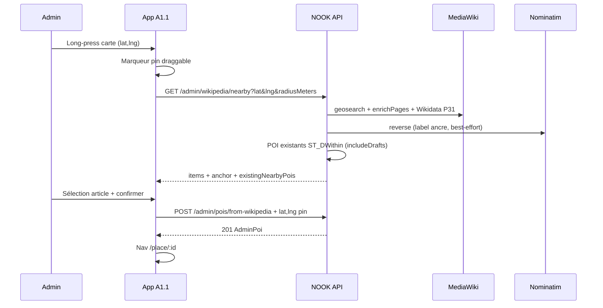

# T28 — Admin : ancrage carte → Wikipedia → POI

| | |
|---|---|
| **Dépôt** | `nook_api_v2` + `nook_app_v2` |
| **Durée** | 5–8 j (3 phases livrables indépendamment) |
| **Dépend de** | T23, T24, T25 (flux B9 existant) |
| **Bloque** | — |
| **Priorité** | Admin — évolution B9 (V1.1) |
| **Features** | F-014 (création POI), F-004 (géo) |
| **Priorité écran** | **B9.1** — extension [`ecran-B9.1-admin-carte-ancrage-poi.md`](../ecran-B9.1-admin-carte-ancrage-poi.md) |
| **Statut** | 📋 spec — non implémenté |

## Problème

En visite sur le terrain, l’opérateur admin connaît **l’emplacement physique** du lieu mais pas forcément son entrée dans NOOK. Le flux B9 actuel (T25) part d’une **recherche texte Wikipedia** : il oblige à chercher le nom hors app, puis à le retaper dans NOOK. La carte ne sert qu’à ouvrir la feuille, pas à **ancrer** le POI.

## Objectif produit

Permettre à un admin de **poser un point sur la carte** (ou d’utiliser sa position), de voir les **articles Wikipedia à proximité**, de sélectionner le bon candidat, puis de créer le POI en **brouillon** avec les coordonnées du pin (override wiki), avant génération audio (T26).

## Décisions figées

| Sujet | Choix |
|-------|--------|
| Point d’entrée principal | Long-press carte **A1.1** (admin) + onglet « Près d’ici » dans la feuille existante |
| Source candidats | MediaWiki `list=geosearch` (proxy API, pas d’appel direct Wikipedia) |
| Position POI créé | **Override pin** prioritaire sur coords Wikipedia (`resolveLocation` existant) |
| Statut création | Toujours `DRAFT` (inchangé B9) |
| Doublons | Alerte non bloquante si POI NOOK existant &lt; 75 m |
| Fallback sans candidat wiki | Phase 3 — POI minimal `POST /admin/pois` (hors Phase 1) |
| OSM / Overpass | Hors périmètre T28 (backlog séparé) |

## Architecture



---

## Phase 1 — MVP terrain (priorité)

### T28.1 — API : Wikipedia geosearch + doublons

#### Endpoint

| Méthode | Route | Auth | Codes |
|---------|-------|------|-------|
| GET | `/api/v1/admin/wikipedia/nearby` | JWT `ADMIN` | 200 ; 401 ; 403 ; 422 ; 503 ; 429 |

#### Query

| Param | Type | Défaut | Contraintes |
|-------|------|--------|-------------|
| `lat` | number | — | requis, [-90, 90] |
| `lng` | number | — | requis, [-180, 180] |
| `radiusMeters` | number | `300` | [50, 2000] |
| `lang` | string | `fr` | ISO 2–3 lettres |
| `limit` | number | `10` | [1, 20] |

#### Réponse

```json
{
  "anchor": {
    "lat": 48.8584,
    "lng": 2.2945,
    "label": "Tour Eiffel, 5 Avenue Anatole France, Paris",
    "radiusMeters": 300
  },
  "items": [
    {
      "title": "Tour Eiffel",
      "wikipediaUrl": "https://fr.wikipedia.org/wiki/Tour_Eiffel",
      "description": "tour de fer puddlé…",
      "thumbnailUrl": "https://upload.wikimedia.org/…",
      "distanceMeters": 42,
      "wikiLat": 48.85837,
      "wikiLng": 2.294481
    }
  ],
  "existingNearbyPois": [
    {
      "id": "uuid",
      "title": "Tour Eiffel",
      "status": "PUBLISHED",
      "distanceMeters": 38
    }
  ]
}
```

- `items` : même politique Nook que T23 (`isNookWikipediaCandidate`), tri **distance croissante** (`distanceMeters`, puis `title`).
- `anchor.label` : `GeoService.reverseGeocode` best-effort ; `null` si échec.
- `existingNearbyPois` : requête PostGIS `ST_DWithin` sur **tous statuts** (`DRAFT` inclus), rayon fixe **75 m** (indépendant de `radiusMeters` wiki), max 5 résultats, tri distance.

#### Implémentation API

| Fichier | Action |
|---------|--------|
| `src/mediawiki/mediawiki.client.ts` | Ajouter `geoSearchPages({ language, lat, lng, radiusMeters, limit })` → `list=geosearch`, `gscoord=lat|lng`, `gsradius`, `gslimit` |
| `src/mediawiki/mediawiki.client.spec.ts` | Parsing hits + `dist` |
| `src/wikipedia/admin-wikipedia-nearby.service.ts` | Orchestration geosearch → enrich → P31 → map DTO |
| `src/wikipedia/admin-wikipedia-nearby.service.spec.ts` | Filtre, tri, mock MW/Wikidata |
| `src/wikipedia/dto/admin-wikipedia-nearby.query.dto.ts` | Validation query |
| `src/wikipedia/dto/admin-wikipedia-nearby.response.dto.ts` | Swagger |
| `src/wikipedia/admin-wikipedia.controller.ts` | Route `GET nearby` + throttle (30/min, aligné search) |
| `src/pois/pois.service.ts` ou helper admin | `findNearbyForAdmin({ lat, lng, radiusMeters: 75, limit: 5 })` réutilisant SQL existant avec `includeDrafts: true` |
| `docs/api-client-reference.md` | Section admin-wikipedia/nearby |
| `nook_app_v2/docs/api-client-reference.md` | Sync |

#### MediaWiki `geosearch` (référence)

```
GET https://{lang}.wikipedia.org/w/api.php
  ?action=query
  &list=geosearch
  &gscoord={lat}|{lng}
  &gsradius={radiusMeters}
  &gslimit={limit}
  &gsprop=type|dim
  &format=json
```

- `gsradius` max MediaWiki : **10 000 m** ; notre plafond API **2 000 m** suffit pour le terrain.
- Repasser par `enrichPages` pour description, image, Wikidata (comme T23).

---

### T28.2 — App : pin carte + flux nearby

#### Entrées UX (convergence vers une seule feuille)

1. **Long-press** sur `HomeMap` (admin uniquement) → pin + ouverture feuille en mode `nearby`.
2. **Bouton « + »** existant → feuille avec **segmented control** : `Près d’ici` | `Rechercher` (flux T25 inchangé).

#### Comportement carte

| Élément | Règle |
|---------|--------|
| Long-press | Uniquement si `canUseAdminEditorialTools` ; sinon ignoré |
| Pin | `Marker` draggable ; coords = ancre requête nearby |
| Debounce | 400 ms après fin de drag avant refetch nearby |
| Rayon UI | Stepper ±50 m (100 → 2000) ; défaut 300 m |
| Carte | `fitToCoordinates` pin + user location si dispo (padding 80) |

#### Feuille `AddWikipediaPoiSheet` (refactor léger)

Étendre les phases :

```ts
type SheetPhase =
  | { kind: 'search' }
  | { kind: 'nearby'; anchor: { lat: number; lng: number }; radiusMeters: number }
  | { kind: 'confirm'; item: WikipediaSearchItem; anchor?: { lat: number; lng: number } }
  | { kind: 'success'; poi: AdminPoi; missingCoords: boolean };
```

- Mode `nearby` : liste triée par distance, badge `{distanceMeters} m`, alerte si `existingNearbyPois.length > 0`.
- Confirmation : afficher pin + « Position : point sur la carte » ; CTA inchangé.
- Création : passer `lat`/`lng` de l’ancre si présents :

```ts
await createPoiFromWikipedia({
  wikipediaUrl: item.wikipediaUrl,
  status: 'DRAFT',
  lat: anchor?.lat,
  lng: anchor?.lng,
});
```

#### Fichiers app

| Fichier | Action |
|---------|--------|
| `components/home/HomeMap.tsx` | Props `onLongPress?(coord)`, `placementPin?` |
| `app/(tabs)/index.tsx` | État pin admin, wiring long-press |
| `components/admin/AdminAddPlaceEntry.tsx` | État partagé pin / mode initial |
| `components/admin/AddWikipediaPoiSheet.tsx` | Phases nearby + segmented |
| `components/admin/AddWikipediaNearbyStep.tsx` | **nouveau** — liste + rayon + alerte doublons |
| `components/admin/AddWikipediaConfirmStep.tsx` | Afficher ancre + coords override |
| `hooks/useWikipediaNearby.ts` | **nouveau** — fetch + debounce drag |
| `lib/api/adminWikipedia.ts` | `searchWikipediaNearby({ lat, lng, radiusMeters, lang, limit })` |
| `lib/api/__tests__/adminWikipedia.test.ts` | Query string + parsing |
| `lib/i18n/locales/fr/adminAddPlace.json` | Clés nearby (voir B9.1) |
| `lib/i18n/locales/en/adminAddPlace.json` | Idem EN |
| `lib/analytics.ts` | `admin_map_pin_placed`, `admin_wiki_nearby_search`, `admin_poi_created_from_map` |

#### Propagation carte ↔ feuille

- `AdminAddPlaceEntry` détient `placementPin: { lat, lng } | null` et `initialMode: 'search' | 'nearby'`.
- Long-press sur carte : set pin + `setSheetVisible(true)` + `initialMode='nearby'`.
- Fermeture feuille sans succès : **conserver** le pin (l’admin peut ajuster) ; clear pin après création réussie ou action explicite « Annuler le point ».

---

## Phase 2 — Recherche géo-biaisée + édition position

### T28.3 — API : bias sur recherche texte

Étendre `GET /admin/wikipedia/search` :

| Param optionnel | Effet |
|-----------------|-------|
| `lat`, `lng` | Si présents : enrichir chaque item avec `distanceMeters` (haversine wiki coords ↔ ancre) |
| `radiusMeters` | Si présent avec lat/lng : **exclure** items au-delà du rayon après filtre Nook |
| — | Tri : d’abord distance croissante, puis ordre MediaWiki |

Pas de changement breaking : params optionnels, rétrocompatible T23.

### T28.4 — App : recherche contextualisée

- En mode `search`, si pin actif ou GPS dispo : envoyer `lat`/`lng`/`radiusMeters` à `searchWikipedia`.
- Afficher `distanceMeters` sur les cartes résultat quand présent.
- Écran confirmation : mini-carte avec pin draggable ; coords mises à jour avant `POST from-wikipedia`.

### T28.5 — Édition post-création (optionnel Phase 2)

- Sur fiche A3.1 admin : action « Déplacer sur la carte » → `PATCH /admin/pois/:id` avec `{ lat, lng }` (endpoint existant).
- Hors scope si pas de gate admin sur A3.1 : reporter en T28.6 ou B3.

---

## Phase 3 — Fallback brouillon minimal (backlog)

### T28.7 — POI sans Wikipedia

Quand `items` vide après geosearch **et** recherche texte :

- CTA secondaire « Créer un brouillon ici » → `POST /admin/pois` avec `title` = `anchor.label` ou « Lieu sans nom », `lat`/`lng`, `status: DRAFT`.
- Nav A3.1 ; pas d’audio tant que `wikipediaUrl` absent (message explicite).

---

## Hors périmètre T28

- Import OSM / Overpass / Wikidata SPARQL
- Création POI par utilisateurs non-admin
- Publication automatique (`PUBLISHED`)
- Collage URL Wikipedia libre (hors sélection liste)
- Clustering carte des candidats wiki (liste suffit en V1)

---

## Critères d’acceptation — Phase 1

### API

- [ ] `GET /admin/wikipedia/nearby?lat=48.8584&lng=2.2945&lang=fr` → 200, `items` non vide (Tour Eiffel en seed réseau)
- [ ] Items exclus si denylist P31 ou sans média (même règle T23)
- [ ] `existingNearbyPois` contient un POI à &lt; 75 m si présent en base
- [ ] JWT `USER` → 403 ; sans JWT → 401
- [ ] `lat`/`lng` invalides → 422
- [ ] Timeout MediaWiki → 503
- [ ] `npm test` vert (client MW + service nearby)

### App

- [ ] Admin : long-press carte place un pin et ouvre la feuille « Près d’ici »
- [ ] Liste candidats Wikipedia triée par distance ; sélection → confirmation → création
- [ ] `POST from-wikipedia` reçoit `lat`/`lng` du pin ; POI créé à la position du pin (pas seulement wiki)
- [ ] Alerte doublon affichée si `existingNearbyPois` non vide ; création toujours possible
- [ ] USER : pas de long-press admin, pas de changement flux standard
- [ ] Mode recherche T25 inchangé fonctionnellement
- [ ] `npm test` vert (client + hooks)

### E2E manuel terrain

- [ ] Monument connu : pin → candidat en tête de liste → POI sur carte NOOK après création
- [ ] Drag pin : liste se met à jour
- [ ] Lieu sans article wiki à proximité : état vide + invitation recherche texte

---

## Estimation par phase

| Phase | API | App | Total |
|-------|-----|-----|-------|
| 1 MVP | 1,5–2 j | 2,5–3 j | **4–5 j** |
| 2 bias + pin confirm | 1 j | 1,5–2 j | **2,5–3 j** |
| 3 fallback brouillon | 0,5 j | 1 j | **1,5 j** |

---

## Références

- [B9 flux existant](../ecran-B9-admin-wikipedia-poi-audio.md)
- [B9.1 extension carte](../ecran-B9.1-admin-carte-ancrage-poi.md)
- [T23](./T23-api-wikipedia-search.md), [T24](./T24-api-poi-from-wikipedia.md), [T25](./T25-app-admin-wikipedia-poi.md)
- `AdminPoisService.resolveLocation` — override pin déjà supporté
- MediaWiki [geosearch](https://www.mediawiki.org/wiki/API:Geosearch)
